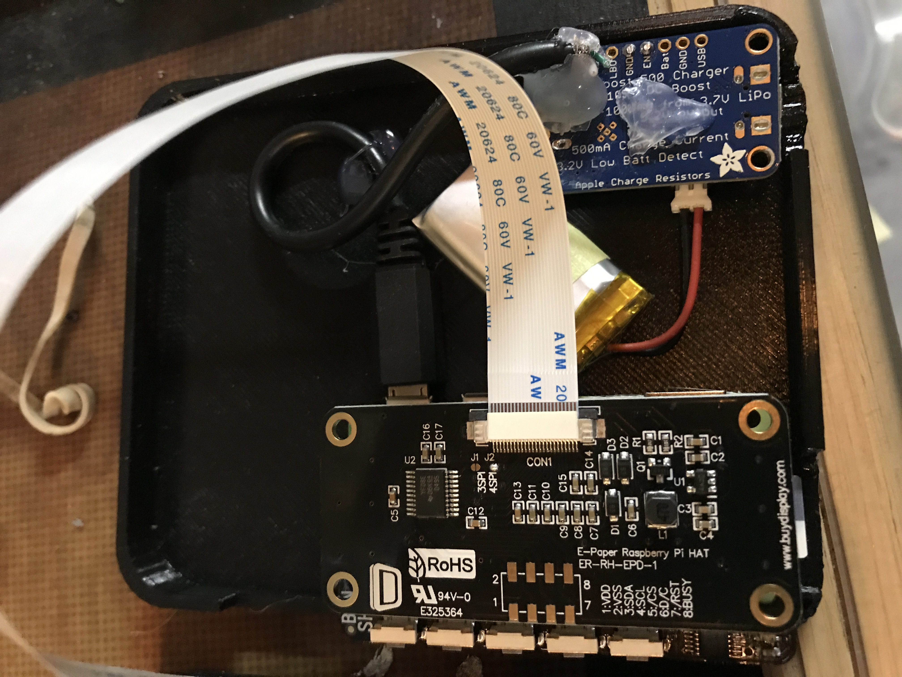

---Still in progress---
For this version, I started with the "fourInchKeys" version and then added a button SHIM from Pimoroni.  Since I was upgrading, I added ePub support and it now shows images as well as text.  I wanted this version to be a little more polished, so I used a Pi Zero and a 3D printed case instead of a cardboard box.  

<bold>Setup:</bold>
First get your pi setup (https://www.raspberrypi.org/%20downloads/) I am using the lite version since this will be running headless.  

After raspi-config to set up your wifi and other settings, run
```
sudo apt-get update
```
and then
```
sudo apt-get upgrade
```
to make sure everything is up to date.  We'll need git so next is
```
sudo apt-get install git
```
We'll need python3 environment set up with pip and the pillow image libraries so next is
```
sudo apt-get install python3-pip
sudo apt-get install python3-pil
sudo apt-get install python3-lxml
```
Now to download the requirements.txt, you can, of course, install these separately on your own instead.  
```
wget https://raw.github.com/townmath/eReader/main/fourInchButtons/requirements.txt
```
Now we'll install the dependencies
```
sudo pip3 install -r requirements.txt
```
Now to following the steps here from the ePaper company: https://www.waveshare.com/wiki/4.2inch_e-Paper_Module#Raspberry_Pi

We will enable SPI and I2C interface using raspi-config under 3 Interface Options, select 4 SPI and yes to enable (then do the same for I2C).  Much of the next few steps are pasted verbatim from the linked wiki.  We'll install BCM libraries.

```
wget http://www.airspayce.com/mikem/bcm2835/bcm2835-1.60.tar.gz
tar zxvf bcm2835-1.60.tar.gz
cd bcm2835-1.60/
sudo ./configure
sudo make
sudo make check
sudo make install
#For more details, please refer to http://www.airspayce.com/mikem/bcm2835/
```
Then the wiringpi
```
sudo apt-get install wiringpi
```
Then we'll clone their libraries so we can interface with the screen using python.
```
sudo git clone https://github.com/waveshare/e-Paper
```

After following those steps, put the code and pdfs in /boot/books/, a folder you have create.  This way you can add books from a regular computer, since the boot folder is visible when you plug the flash drive in.   

Next, from the pi (or ssh into it if that is your thing) open the .config folder in the /home/pi/ folder (cd .config) and then create a folder called autostart if it doesn't exist.  Inside this directory create a text file called eReader.desktop containing the following lines:
```
[Desktop Entry]

Type= Application

Name= eReader

Exec= x-terminal-emulator -e "python3 /boot/books/eReader.py"
```
Now when you reboot it should display whatever pdfs you have in /boot/books/ as a simple menu, use up and down arrows to select and enter to choose.  Once your book is open, right arrow is forward pages, left arrow is back.  Any other key will quit.  This is meant to be able to run headless, that is why it shuts down when you exit and starts on startup.  

Here is the inside, I hot glued the pieces in place. 


Finally the eReader in action. 


Enjoy.

Sample ebook from https://www.gutenberg.org/ebooks/11     

Dejavu font from: https://www.fontsquirrel.com/fonts/DejaVu-Sans
