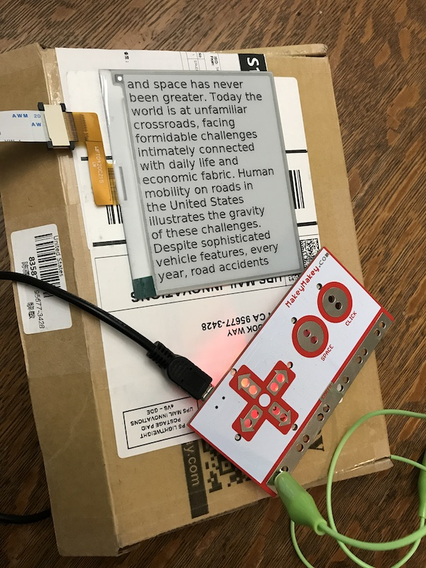

This was made for a Raspberry Pi together with a 4.2 inch ePaper display (like those from waveshare).  This is assuming you already followed all of the steps here: https://www.waveshare.com/wiki/4.2inch_e-Paper_Module#Raspberry_Pi 


After following those steps, put the code and pdfs in /boot/books/, a folder you have create.  This way you can add pdfs from a regular computer, since the boot folder is visible when you plug the flash drive in.   

Next, from the pi (or ssh into it if that is your thing) open the .config folder in the /home/pi/ folder (cd .config) and then create a folder called autostart if it doesn't exist.  Inside this directory create a text file called eReader.desktop containing the following lines:
```
[Desktop Entry]

Type= Application

Name= eReader

Exec= x-terminal-emulator -e "python3 /boot/books/eReader.py"
```
Now when you reboot it should display whatever pdfs you have in /boot/books/ as simple menu, use up and down arrows to select and enter to choose.  Once your book is open, right arrow is forward pages, left arrow is back.  Any other key will quit.  This is bare-bones and only does text, but with this size screen it is hard to do much else.  This is meant to be able to run headless, that is why it shuts down when you exit and starts on startup.  If you don't want to be tethered to a full keyboard, you could use a makey makey. 



Enjoy. 

Sample ebook from https://www.gutenberg.org/ebooks/11
