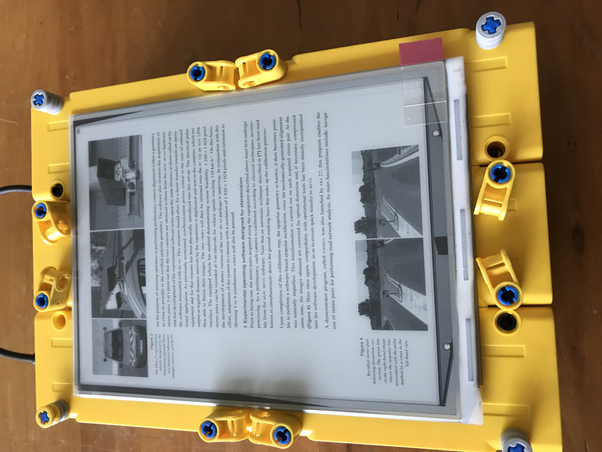
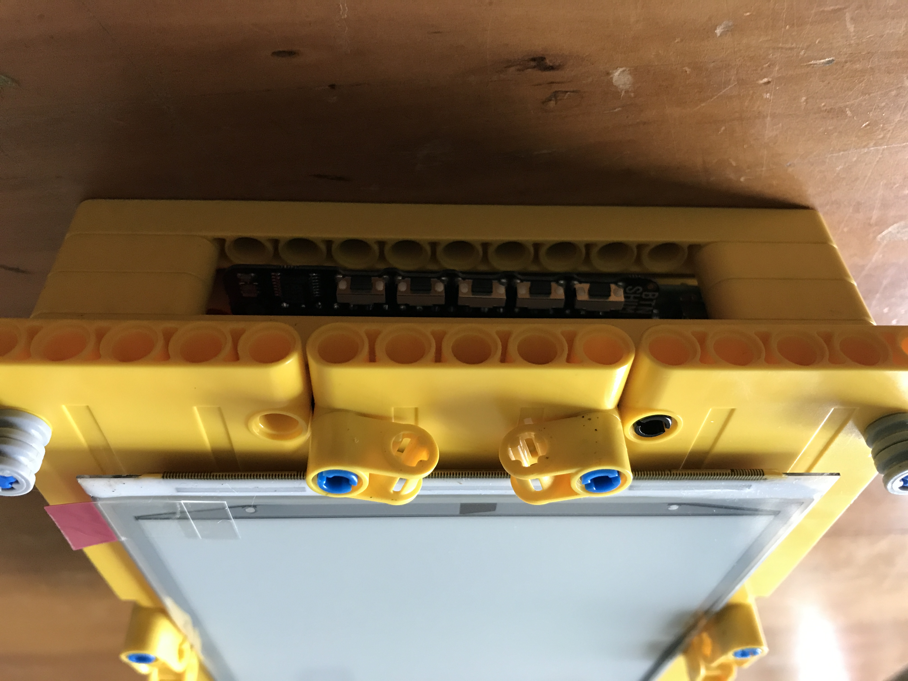

This one is not an inexpensive version, I think, not counting the legos, it is at around $200.  But it does meet my personal goals of being open source and not needing to print out Computer Science articles.  

The six inch ePaper display is the [HD one from waveshare](https://www.waveshare.com/6inch-e-paper-hat.htm) which has been discontinued, so sorry if you are hoping to build this.  The code itself should work for any epd with high enough resolution and I tried to follow the format of the other epd libraries so it would be (mostly) compatible.  

Besides treating the pdf page as an image instead of text, the difference between this and the 4 inch button version is that the buttons are on the bottom so I had to rearrange their order.  Right most is next page, left most is previous page, middle right is zoom in, middle left is zoom out, and middle is enter/sleep/shutdown.  

If you use my (or their) IT8951 code you need to compile it as a shared library like so:    
`gcc -shared -Wall -Wl,-soname,IT8951 IT8951.c miniGUI.c main.c AsciiLib.c bmp.c -o IT8951.so -lbcm2835`.    
Thanks to https://stackoverflow.com/questions/5081875/ctypes-beginner for the format.   
