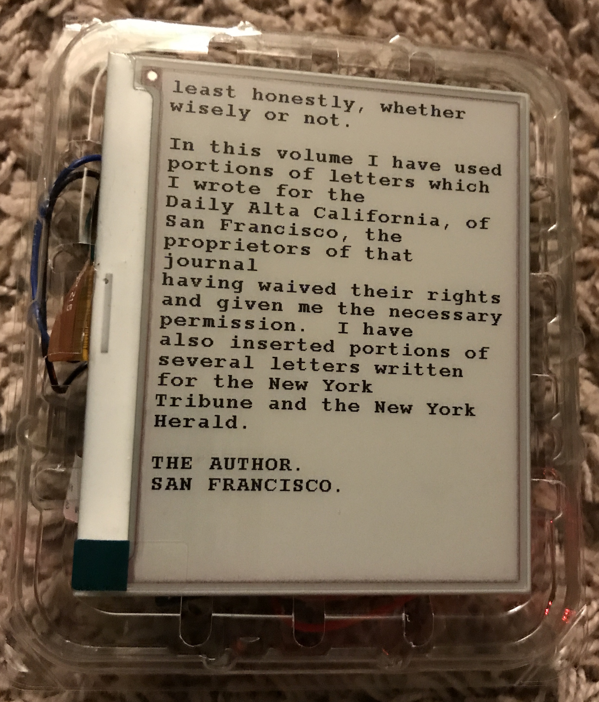
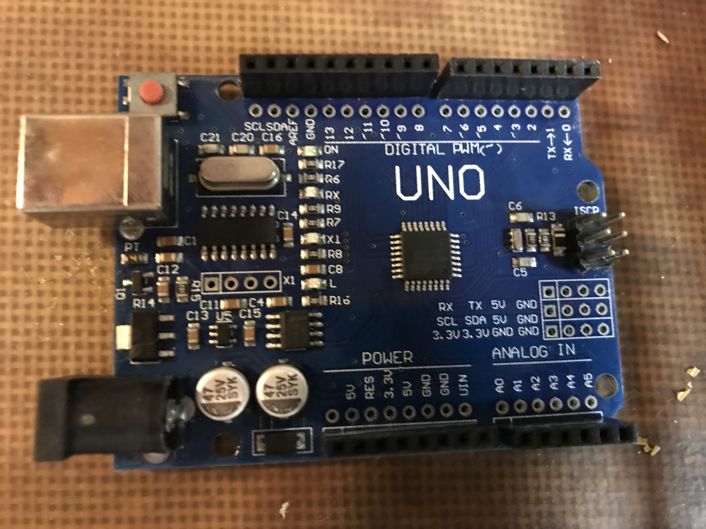

For this version, I started with the [Open Book code by Joey Castillo](https://github.com/joeycastillo/The-Open-Book) and then erased as much as I could while still leaving basic functionality so it could fit on an Arduino Uno.  You can only read one book at a time so that is why this one is called the Uno Book, it is on the Uno and you can only read one book at a time.  
 
For this I used an Arduino Uno knock-off I got from eBay for about 5 dollars, a [Waveshare 4.2-inch epd](https://www.waveshare.com/wiki/4.2inch_e-Paper_Module), an [E-paper Shield](https://www.waveshare.com/wiki/E-Paper_Shield), a blueberry clam-shell container, a small SD card, an [AA battery holder](https://www.adafruit.com/product/830), a few [momentary switches](https://www.adafruit.com/product/830), and some breadboard wires.  The reason I used the knock-off Arduino was because it has holes for soldering.  

<b>Setup:</b> 
The setup for this version should be much easier than the Raspberry Pi versions.
First open the unoBook.ino in the [Arduino IDE](https://www.arduino.cc/en/software) and load it onto your Arduino.  
Then place the book in .obk format in the root of the SD card.  If you want to make your own book go to [project gutenberg](https://www.gutenberg.org) and download the book you would like in .txt format.  Then run the bookbinder.py (courtesy of Joey Castillo's Open Book Project).  You can only read one book at a time, but changing books is as easy as plugging your SD card into the computer.
 
Then wire the buttons, one side to GND and the other side to a pin: Next Page to pin A0, Prev Page to pin A3, and Select to pin A1.  I used the Analog inputs as digital inputs because of their location on the board, feel free to change them for your particular setup.   
With the Arduino still unplugged wire the epd as instructed.   
Now when you plug it in, it should work!
 
<video width="320" height="240">
  <source src="unoBook_in_action.mov" type="video/mp4">
</video> 

Enjoy. 
The Innocents Abroad by Mark Twain from https://www.gutenberg.org/ebooks/3176   
